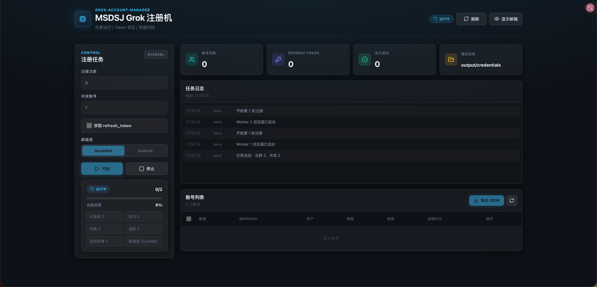

# grok-account-manager
 
Grok 账号注册与凭证管理工具。项目提供 Python 自动化注册流程和 React 本地控制台，支持 DuckMail、Cloud Mail、Outlook/Google 邮箱接码、GrokAccount JSON 凭证归档，以及可选推送到外部 Sub2API 实例。

本项目允许免费使用、学习和二次开发。请勿把 `.env`、邮箱服务 Token/密码、Outlook refresh token、浏览器 cookie、SSO token 或 `output/` 里的凭证提交到 GitHub。

## 文档

- [完整部署、运行与使用指南](docs/deployment-and-usage.md)：环境准备、CLI、控制台、代理池、本地中转、更新与排错。
- [快速使用教程](docs/getting-started.md)：从安装到启动前后端、运行注册任务和提交前安全检查。
- [更新日志](CHANGELOG.md)：按日期整理的功能变更。
- [DuckMail 邮箱源](docs/duckmail.md)
- [Cloud Mail 邮箱源](docs/cloud-mail.md)
- [Outlook 邮箱池](docs/outlook-mailbox-pool.md)
- [Grok OAuth Flow](docs/grok-oauth-flow.md)

## 项目界面



## 项目地址与交流群

GitHub：<https://github.com/msdsj/grok-account-manager-main>

如果这个项目帮到你，欢迎帮忙点一个 Star。使用中遇到账号池、Grok CLI 4.5、Chat 对话或图片生成问题。
## 更新日志

完整版本记录见 [CHANGELOG.md](CHANGELOG.md)。当前版本重点更新 FastAPI 后端重构、账号数据库、Grok CLI 4.5 测试、Chat/图片测试、本地中转和新版控制台界面。

## 功能

- Grok 邮箱注册自动化，注册资料姓名和密码每轮随机生成。
- 邮箱源支持 DuckMail、Cloud Mail、Outlook、Gmail/Google；账号池兼容 `----` 和 `|` 两种分隔格式。
- 可选注册代理池：每个注册浏览器随机领取一个未使用端点，下一轮重启浏览器时切换到新的端点。
- 注册页、浏览器启动和 OAuth 短暂网络错误都有有界重试，任务停止后不会继续拉起浏览器。
- 输出 cockpit-tools 可导入的 GrokAccount JSON 数组，并同步写入本地账号数据库。
- React 控制台使用侧边栏路由，支持注册任务、账号列表、Grok CLI 4.5 测试、Chat 对话测试、图片生成测试和本地中转。
- 可选 `sub2api` sink，把注册结果写入独立部署的 Sub2API 管理 API。

## 环境要求

- Python 3.12 或 3.13
- uv
- Google Chrome 或 Chromium
- Node.js 20+ 与 npm，用于前端开发/构建

注册流程默认打开可见浏览器窗口。Grok 的 Turnstile 验证对 headless 不稳定，不建议后台无窗口运行。

## 快速开始

```bash
uv sync
cp .env.example .env
```

编辑 `.env`，选择并配置一种邮箱源。默认 DuckMail 示例：

```bash
DUCKMAIL_API_KEY=your_duckmail_api_key
DUCKMAIL_DOMAIN=@msdsj.cyou
```

单轮注册并保存 JSON：

```bash
uv run grok-account-manager grok --count 1 --sink json
```

也可以用模块方式运行：

```bash
uv run python -m grok_account_manager grok --count 1 --sink json
```

## 注册代理池

CLI 与本地控制台都支持从代理列表为每轮注册分配独立的浏览器出口。未显式指定路径时，会自动检查 `~/Downloads/xx.txt`，并与控制台保存的节点合并去重；也可以在 `.env` 或命令行指定其他文件：

```bash
GROK_ACCOUNT_MANAGER_PROXY_FILE=~/Downloads/xx.txt
```

```bash
uv run grok-account-manager grok --count 10 --proxy-file ~/Downloads/xx.txt --sink json
```

代理文件使用 UTF-8 编码，每行一个端点；空行、以 `#` 开头的行和行尾注释会忽略。裸 `HOST:PORT` 按 HTTP 代理处理，也支持显式的无认证 `http://` 和 `https://`：

```text
# proxies.txt
198.51.100.10:8080
http://198.51.100.11:8080
https://198.51.100.12:8443
```

同一任务中会随机领取端点且不重复使用。注册浏览器首次启动即绑定首个端点；每轮结束后重启浏览器并领取下一个端点，Provider 级重试也会先领取新端点。请求轮数超过可用端点数时，CLI 会按代理池大小收尾，避免复用出口；使用 `--count 0` 时也会在池耗尽后结束。运行日志只显示脱敏后的代理摘要。当前浏览器适配器不支持带用户名/密码或 SOCKS 节点；请保留实际代理文件在本地并加入忽略规则。

### 控制台保存节点

打开本地控制台的“注册任务”，启用“注册代理池”后点击“管理已保存节点”。在弹窗中粘贴每行一个端点，按“保存节点”即可持久化；默认追加并去重，打开“替换现有节点”后会以本次内容覆盖原池，也可以直接清空保存的节点。保存的节点位于 `output/registration-proxies.json`，文件以仅当前用户可读写权限保存，界面与任务日志只显示脱敏摘要。

注册任务的代理来源按以下规则选择：

- 关闭“注册代理池”或 CLI 使用 `--no-proxy`：强制直连。
- 填写控制台的代理文件路径，或设置 `GROK_ACCOUNT_MANAGER_PROXY_FILE` / CLI `--proxy-file`：只使用该文件。
- 路径留空：合并 `~/Downloads/xx.txt`（存在时）与“管理已保存节点”中的内容，并按规范地址去重；两者都没有时保持直连。

要显式跳过自动发现或 `.env` 中的代理文件，使用：

```bash
uv run grok-account-manager grok --count 1 --no-proxy --sink json
```

每个代理端点是否对应独立公网出口由代理服务本身决定；程序按端点分配，并在浏览器进程重启时应用新的网络设置。

## Cloud Mail 邮箱源

支持 maillab/cloud-mail 兼容 API。每轮会创建一个随机邮箱，并通过 Public Token 或站点账号登录读取该地址的新邮件。API 地址末尾可以包含 `/api`，多个域名使用逗号或换行分隔。

Public Token 配置：

```dotenv
GROK_ACCOUNT_MANAGER_EMAIL_SOURCE=cloud_mail
CLOUD_MAIL_API_BASE=https://mail.example.com
CLOUD_MAIL_DOMAINS=example.com,example.net
CLOUD_MAIL_PUBLIC_TOKEN=replace-with-public-token
```

账号登录配置：

```dotenv
GROK_ACCOUNT_MANAGER_EMAIL_SOURCE=cloud_mail
CLOUD_MAIL_API_BASE=https://mail.example.com/api
CLOUD_MAIL_DOMAINS=example.com
CLOUD_MAIL_LOGIN_EMAIL=admin@example.com
CLOUD_MAIL_LOGIN_PASSWORD=replace-with-password
```

CLI 也可以直接传入同名参数：

```bash
uv run grok-account-manager grok --count 1 \
  --email-source cloud_mail \
  --cloud-mail-api-base https://mail.example.com \
  --cloud-mail-domains example.com \
  --cloud-mail-public-token replace-with-public-token \
  --sink json
```

完整协议、认证方式和安全说明见 [Cloud Mail 邮箱源](docs/cloud-mail.md)。

## Outlook 邮箱源

把 Outlook 账号池保存为本地文件，例如 `outlook_accounts.txt`。该文件已被 `.gitignore` 忽略。账号字段支持 `----` 或 `|` 两种分隔符。第五段可选，用于指定 Microsoft 邮件读取方式：`auto`、`imap` 或 `graph`；不填时默认 `auto`，会先尝试 IMAP，再尝试 Microsoft Graph。

```text
email@example.com----password----clientId----refreshToken
email@example.com----password----clientId----refreshToken----graph
email@example.com|password|clientId|refreshToken|auto
```

运行：

```bash
uv run grok-account-manager grok --count 1 \
  --email-source outlook \
  --outlook-accounts-file outlook_accounts.txt \
  --sink json
```

也可以在 `.env` 中设置：

```bash
GROK_ACCOUNT_MANAGER_EMAIL_SOURCE=outlook
OUTLOOK_ACCOUNTS_FILE=outlook_accounts.txt
```

Google/Gmail 账号池同样支持两种格式：

```text
email@gmail.com----password----recovery@example.com
email@gmail.com|password|recovery@example.com
```

Outlook、Gmail 和 Google 账号在一次进程中只会领取一次，池耗尽后会明确报错，不会循环复用已参与注册的邮箱。如果开启多并发或页面失败重试，账号池行数需要留出相应余量。

## 本地数据库

账号完整凭证、导出索引和测试结果会写入本地 SQLite：

```bash
GROK_ACCOUNT_MANAGER_DB_PATH=output/grok-account-manager.db
```

`docker-compose.yml` 预留了本地 Postgres 服务，后续如果要切到 Postgres，需要再安装对应 Python 驱动并迁移数据库层；当前默认 SQLite 不需要额外容器即可使用。

## 本地控制台

后端现在是单一 FastAPI 服务，注册机 API、中转站管理 API 和 OpenAI 兼容代理都由它提供。开发模式运行两个进程：一个后端、一个前端。

```bash
uv run grok-account-manager-api
```

```bash
cd web
npm install
npm run dev
```

打开 `http://127.0.0.1:43188`。前端开发服务器会把 `/api`、`/v1`、`/healthz` 和 `/readyz` 代理到 FastAPI 后端。

并发注册时每个 worker 使用独立临时 Chrome profile、独立调试端口和独立的稳定浏览器指纹，窗口会错峰启动。注册页面可按所选并发数同时运行；为降低同一出口 IP 对 xAI Device OAuth 的突发限速，`refresh_token` 阶段默认最多同时运行 2 个窗口，其余窗口会在各自浏览器中排队：

```bash
GROK_ACCOUNT_MANAGER_MAX_CONCURRENCY=20
GROK_ACCOUNT_MANAGER_MAX_OAUTH_CONCURRENCY=2
GROK_ACCOUNT_MANAGER_MAX_REGISTRATION_ATTEMPTS=3
```

浏览器 profile 和指纹隔离不能改变所有窗口共享本机出口 IP 的事实，不能保证绕过平台风控。勾选“获取 refresh_token”时，只有拿到有效 RT 的账号才会写入 `sso.txt`、`grok_credentials.json` 和账号数据库；OAuth 失败或超时时，SSO checkpoint 会保留在本地恢复队列，但不会冒充 RT 完整账号导入账号库。未勾选时仍按 SSO 模式保存。

生产模式可先构建前端：

```bash
cd web
npm run build
cd ..
uv run grok-account-manager-api
```

然后打开 `http://127.0.0.1:43187`。旧命令 `uv run grok-account-manager-web` 仍然可用，内部指向同一个 FastAPI 入口。

## 输出文件

- `output/credentials/grok_credentials.json`：GrokAccount JSON 数组。
- `output/grok-account-manager.db`：本地账号数据库。
- `output/sso.txt`：使用 `txt` sink 时写入的 SSO 兜底文本。
- `output/sso-failed.txt`：Sub2API 写入失败时的兜底文本。
- `output/pending-registration-results.json`：控制台任务的未完成 OAuth checkpoint 和落盘失败恢复队列。
- `output/registration-proxies.json`：控制台导入的注册节点池，仅当前用户可读写。

`output/` 是运行产物目录，默认不纳入 Git。

恢复队列采用原子替换并设为 `0600` 权限。`persistence_failed` 会在 FastAPI 后端下次启动时自动重试；`oauth_pending` 只保留已注册的 SSO 恢复信息，不会自动写入正式账号库。如果现有 `grok_credentials.json` 无法解析或结构非法，sink 会生成同目录 `grok_credentials.json.broken-时间戳` 备份并拒绝覆盖原文件。

## OAuth Refresh Token

默认 JSON 会基于浏览器里的 `sso` cookie 尝试补全用户、订阅和额度信息。如需尝试换取 `refresh_token / id_token`：

```bash
uv run grok-account-manager grok --count 1 --sink json --oauth-exchange
```

该流程使用 xAI Device Flow，会在同一浏览器上打开授权页，并可能需要人工完成网页授权或 Turnstile。

## Sub2API

本仓库不再 vendored Sub2API 源码。请独立部署 [Sub2API](https://github.com/Wei-Shaw/sub2api)，在管理后台生成 Admin API Key 后配置：

```bash
SUB2API_BASE_URL=http://localhost:8080
SUB2API_ADMIN_API_KEY=your_admin_api_key
```

推送：

```bash
uv run grok-account-manager grok --count 1 --sink sub2api
```

## 项目结构

```text
serve/grok_account_manager/
  api/
    app.py                # FastAPI 应用工厂、CORS、SPA 静态入口
    main.py               # 后端启动命令
    routers/              # 注册、账号、中转站、代理 API 路由
    services/             # 任务调度、账号数据库、中转站进程管理
  cli.py                  # CLI 参数解析和轮次调度
  core/browser.py         # Chromium 启停、扩展加载、cookie 等待
  mail/cloud_mail.py      # Cloud Mail 创建邮箱与接码
  mail/duckmail.py        # DuckMail 接码
  mail/sources.py         # 邮箱源工厂及 Outlook / Gmail / Google 实现
  grok/client.py          # GrokAccount JSON 构建与额度 API
  grok/oauth_exchange.py  # xAI OAuth Device Flow
  providers/grok.py       # Grok 注册页面自动化
  sinks/                  # JSON/TXT/Sub2API 输出
extensions/turnstile_patch/
web/src/
  routes.tsx              # 侧边栏页面路由配置
scripts/
docs/
```

## 验证

```bash
python3 -X pycache_prefix=/private/tmp/grok-account-manager-pyc -m compileall serve tests
cd web && npm run build
```

## 开源说明与致谢

本项目由 MSDSJ 维护，允许免费使用和二次开发。项目实现参考和感谢以下开源项目：

- [cockpit-tools](https://github.com/jlcodes99/cockpit-tools)：GrokAccount JSON 结构、OAuth 账号管理和导入格式参考。
- [Kiro-account-manager](https://github.com/chaogei/Kiro-account-manager)：账号池管理、邮箱账号格式和桌面账号管理产品思路参考。
- [Sub2API](https://github.com/Wei-Shaw/sub2api)：可选的账号下游管理 API，本项目仅通过其 Admin API 写入账号。
- Turnstile MouseEvent patch 思路来自仓库内 `extensions/turnstile_patch/` 所保留的扩展说明。

本项目与 xAI、Grok、Microsoft、Outlook、DuckMail、Cloud Mail、cockpit-tools、Kiro-account-manager、Sub2API 官方均无隶属关系。使用者需要自行遵守相关服务条款、当地法律和开源许可证要求。
